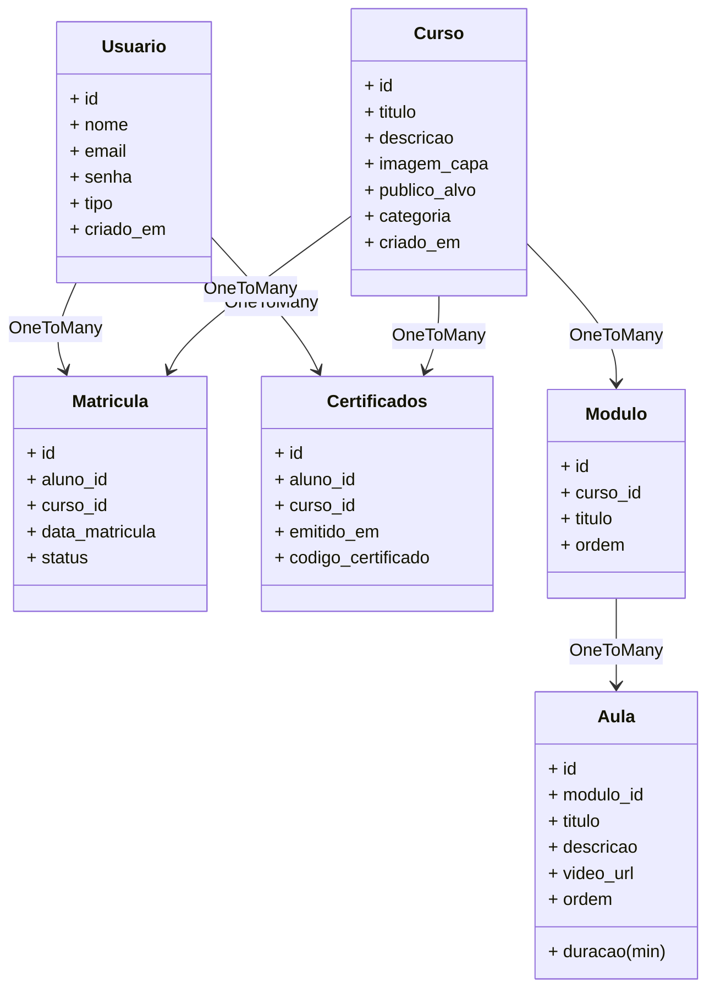

# 📘 Discovery do Projeto – Escola de Cursos Online

## 👨‍🏫 Nome do Projeto
**Escola de Cursos Online**

## 👥 Time
- Eduardo
- Thiago

## 🎯 Visão Geral
O projeto tem como objetivo criar uma **plataforma EAD** (Ensino a Distância) onde alunos possam se cadastrar, se inscrever em cursos, assistir videoaulas, responder avaliações, gerar certificados e acompanhar seu progresso por trilhas de aprendizagem.

A aplicação contará com um painel de administração para gerenciamento dos cursos, trilhas, conteúdos, usuários, pagamentos e geração de relatórios.

Ao acessar a plataforma pela primeira vez, o aluno cria sua conta informando nome, e-mail e senha. Após confirmar seu cadastro, ele pode explorar o catálogo de cursos disponíveis, organizados por áreas de conhecimento e níveis de dificuldade.

Interessado em um curso, o aluno se inscreve com apenas alguns cliques e já tem acesso imediato às videoaulas, apostilas e materiais de apoio. Cada curso está estruturado em módulos, que seguem uma trilha de aprendizagem clara, permitindo que ele acompanhe seu progresso a cada lição concluída.

Durante o aprendizado, o aluno realiza avaliações para testar seus conhecimentos. Se obtiver o desempenho mínimo exigido, ele avança para as próximas etapas até completar o curso.

Ao finalizar todas as atividades, a plataforma gera automaticamente um certificado digital personalizado, que o aluno pode baixar ou compartilhar. Além disso, ele pode acessar a qualquer momento o histórico de cursos concluídos, acompanhar seu progresso em novos cursos e continuar aprendendo no seu próprio ritmo.

## 🧠 Problema a Ser Resolvido
A dificuldade de professores, escolas e pequenos empreendedores em criar uma plataforma acessível para ensinar e vender seus cursos online com controle de progresso e entrega de conteúdo de forma estruturada.

## 👨‍🎓 Público-Alvo
- Estudantes interessados em aprendizado remoto
- Pequenas instituições de ensino
- Instrutores independentes

---

## ✅ Funcionalidades Mínimas do MVP

### Usuário (Aluno)
- Cadastro/Login
- Visualização de cursos disponíveis
- Inscrição em cursos
- Emissão de certificados
- Acompanhamento de progresso

### Admin (Gestor)
- CRUD de cursos
- CRUD de aulas
- Upload de videoaulas
- Emissão de certificados
- Visualização de relatórios

---

## 🧰 Stack de Tecnologias

| Camada         | Tecnologia             |
|----------------|------------------------|
| **Backend**    | Node.js + Express.js   |
| **Frontend**   | React.js (opcional)    |
| **Banco**      | PostgreSQL ou MariaDB  |
| **ORM**        | Prisma ORM             |
| **Testes**     | Jest + Supertest       |
| **Autenticação**| JWT                   |
| **Documentação** | Markdown e Mermaid/Swagger |
| **Gerenciamento** | GitHub Projects     |
| **Prototipação (opcional)** | Figma     |

---

## 📦 Entregáveis

| Entregável                        | Status     |
|----------------------------------|------------|
| Discovery do Projeto              | ✅ |
| Gerenciamento das Tarefas         | ✅ |
| Prototipação de telas (opcional)  | ✅ |
| Implementação Frontend (opcional) | ✅ |
| API em Node.js                    | ✅ |
| Documentação dos Endpoints        | ✅ |
| Desenho do Banco de Dados         | ✅ |
| Testes automatizados dos endpoints| 🔲 |
| Testes unitários (50%)            | ✅ |
| Repositório público no GitHub     | ✅ |
| Apresentação final                | 🔲 |

---

